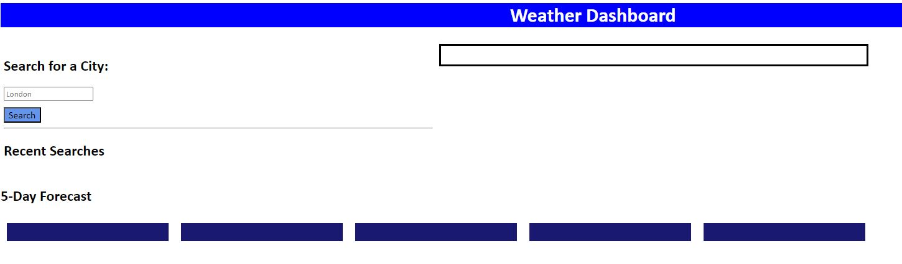
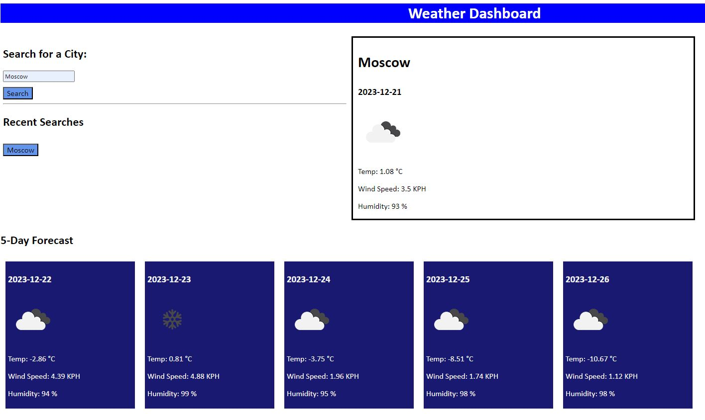
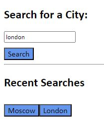
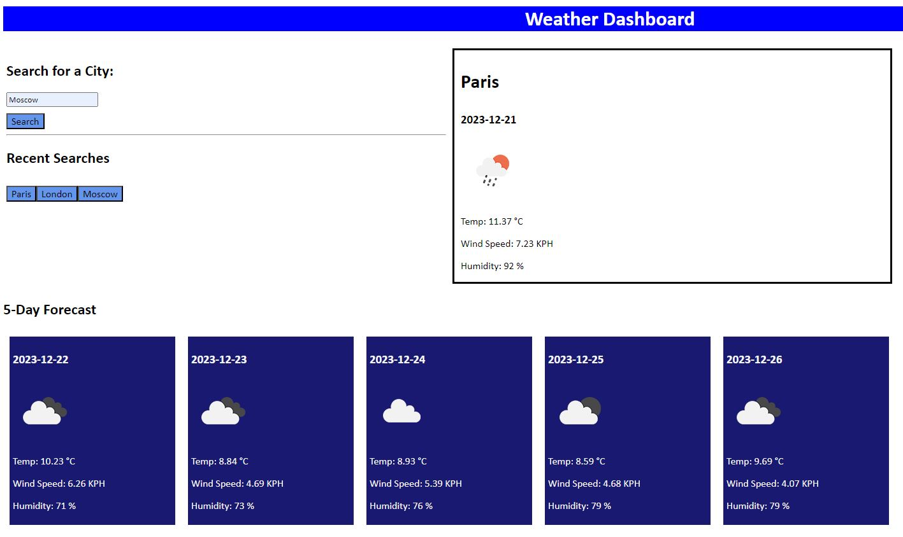

# Weather-App
A weather dashboard with form inputs

# Weather Application
A weather application that allows a user to see the weather outlook for multiple cities. 
Deployed App - 

## Description
When a user searches for a city they are presented with current and future conditions for that city and that city is added to the search history. 

When a user views the current weather conditions for that city they can see the city name, date, icon representation of the weather, temperature, humidity and wind speed. 

When a user clicks on a city in the search history, they are again presented with current and future conditions for that city. 

Through the project, I have developed my understanding of local storage, API keys, CSS, JS and HTML. 

For future development, I would like to change how the application looks when the user initally opens the page. I would also like to prevent the user from being able to store multiple buttons of the same location (e.g. if Moscow is searched for twice, the button should not replicate.)

## Installation

To work on this code copy this SSH key: git@github.com:chelsea32568/Weather-App.git and paste into your desired folder using Git Bash. Then use git pull to pull the file into your local repository. Make necessary changes and then add changes into the git repository by using git add -A, git commit -m "", git push.

## Usage

After opening the HTML file the 'Weather Application appears'

When a user has searched for a location, they are presented with the current and future information. 

Their searches are saved to local storage and can be clicked to present the current and future data again. 

Previous searches can be clicked. 

## Credits

- [How to display the icon image](https://stackoverflow.com/questions/44177417/how-to-display-openweathermap-weather-icon)

- [How to align items in a flex box](https://www.youtube.com/watch?v=Q1d-1FzdXEE)

- [Save text to loca storage] Sean New - Online Tutoring Service

## License

MIT License

Copyright (c) [2023] [Chelsea Chapman]

Permission is hereby granted, free of charge, to any person obtaining a copy
of this software and associated documentation files (the "Software"), to deal
in the Software without restriction, including without limitation the rights
to use, copy, modify, merge, publish, distribute, sublicense, and/or sell
copies of the Software, and to permit persons to whom the Software is
furnished to do so, subject to the following conditions:

The above copyright notice and this permission notice shall be included in all
copies or substantial portions of the Software.

THE SOFTWARE IS PROVIDED "AS IS", WITHOUT WARRANTY OF ANY KIND, EXPRESS OR
IMPLIED, INCLUDING BUT NOT LIMITED TO THE WARRANTIES OF MERCHANTABILITY,
FITNESS FOR A PARTICULAR PURPOSE AND NONINFRINGEMENT. IN NO EVENT SHALL THE
AUTHORS OR COPYRIGHT HOLDERS BE LIABLE FOR ANY CLAIM, DAMAGES OR OTHER
LIABILITY, WHETHER IN AN ACTION OF CONTRACT, TORT OR OTHERWISE, ARISING FROM,
OUT OF OR IN CONNECTION WITH THE SOFTWARE OR THE USE OR OTHER DEALINGS IN THE
SOFTWARE.

© 2023 edX Boot Camps LLC. Confidential and Proprietary. All Rights Reserved.
